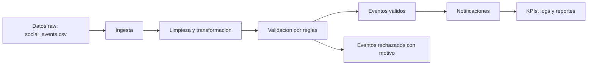
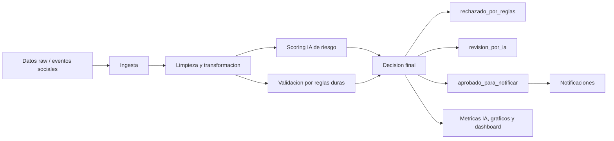

# NotifyOps MVP + Extension IA

Sistema MVP para automatizar una ETL de notificaciones de una red social. Procesa eventos mezclados de likes, comentarios y seguidores, valida anomalias, genera notificaciones, calcula KPIs y produce vistas recientes ordenadas desde el evento mas nuevo al mas antiguo.

Las fechas de los reportes se muestran en formato legible con hora, minuto, segundo y milisegundos:

```text
YYYY-MM-DD HH:MM:SS.mmm
```

Ejemplo:

```text
2026-05-14 09:01:03.000
```

## Estado actual de la entrega

El repositorio contiene la entrega tecnica ejecutable del proyecto:

- MVP DataOps/ETL con datos de entrada, datos procesados, validacion, KPIs, logs y reportes.
- Automatizacion complementaria con Airflow mediante un DAG quincenal.
- Ejecucion reproducible con Docker.
- Extension IA de Parcial 3 con dataset, entrenamiento, metricas, matriz de confusion, graficos, dashboard y decision final.
- Pruebas automatizadas para verificar pipeline, DAG e integracion IA.

## Vision general del proyecto actual

NotifyOps se encuentra organizado en dos fases:

- **Fase 1 - Pipeline DataOps / ETL:** procesa eventos sociales, limpia datos, valida anomalias, carga resultados, genera notificaciones, KPIs y logs.
- **Fase 2 - Extension IA Parcial 3:** agrega un modelo de clasificacion binaria que estima si un evento social es `valido` o `riesgoso` antes de generar o aprobar notificaciones.

La mejora de IA no reemplaza la validacion anterior. La complementa como una capa predictiva:

```text
Reglas duras del pipeline + scoring IA = decision final mas confiable
```

## Flujo antes de IA



En la Fase 1, el sistema decidia con reglas estructurales y semanticas. Por ejemplo: tipo de evento permitido, usuario destino presente, fecha valida y control de duplicados.

## Flujo con IA integrada



La IA se aplica despues de la limpieza y transformacion porque en ese punto los datos ya estan normalizados y pueden convertirse en variables predictivas.
La decision final combina el resultado de reglas duras con la probabilidad de riesgo del modelo.

## Comparativa antes y despues

| Aspecto | Fase 1: ETL DataOps | Fase 2: IA integrada |
|---|---|---|
| Objetivo | Procesar y validar eventos sociales | Anticipar riesgo de eventos antes de notificar |
| Decision | Reglas duras | Reglas duras + probabilidad de riesgo IA |
| Salida principal | Validado / rechazado | `rechazado_por_reglas`, `revision_por_ia`, `aprobado_para_notificar` |
| Evidencia | CSV, SQLite, logs, KPIs | Metricas IA, matriz de confusion, ROC, Gini, dashboard |
| Valor | Ordena y controla el pipeline | Agrega capa predictiva y analisis de rendimiento |
| Utilidad | Evita datos invalidos evidentes | Ayuda a priorizar eventos riesgosos y mejorar reglas |

## Valor agregado de la IA

La extension IA permite demostrar lo solicitado en la Evaluacion Parcial 3:

- entrenamiento de un modelo de clasificacion;
- analisis de calidad de datos;
- analisis univariado y bivariado mediante graficos y correlaciones;
- metricas de rendimiento: accuracy, precision, recall, F1, ROC-AUC y Gini;
- matriz de confusion;
- dashboard local tipo BI;
- identificacion de limitaciones y oportunidades de mejora.

El modelo funciona como un filtro inteligente: calcula una probabilidad de riesgo para cada evento y apoya la decision final del pipeline.

## Evidencia tecnica generada

Despues de ejecutar el proyecto, las evidencias quedan dentro del mismo repositorio:

- `data/reports/ai/model_metrics.csv`: rendimiento del modelo.
- `data/reports/ai/confusion_matrix.csv`: matriz de confusion.
- `data/reports/ai/final_event_decisions.csv`: salida final integrada entre reglas e IA.
- `data/reports/ai/charts/`: graficos para analisis, informe y presentacion.
- `dashboard/notifyops_ai_dashboard.html`: dashboard local para revisar metricas y resultados.
- `logs/notifyops.log`: trazabilidad de ejecucion del pipeline.

## Orden recomendado de ejecucion para revisar el MVP

Ejecutar todos los comandos desde la carpeta raiz del repositorio:

```powershell
cd "C:\ruta\donde\descargaste\ProyecGEIA"
```

### 1. Instalar dependencias

```powershell
pip install -r requirements.txt
```

Este paso prepara las librerias necesarias para ejecutar el pipeline, las pruebas y la generacion de evidencias.

### 2. Ver datos originales antes de la ETL

```powershell
Import-Csv .\data\raw\social_events.csv | Format-Table -AutoSize
```

Los datos de entrada vienen mezclados, desordenados y con anomalias intencionales para demostrar limpieza y validacion.

### 3. Ejecutar pruebas automatizadas

```powershell
python -m unittest discover -v
```

Resultado esperado:

```text
OK
```

### 4. Ejecutar pipeline DataOps

```powershell
python -m src.notifyops.pipeline
```

El pipeline ejecuta ingesta, limpieza, transformacion, validacion, carga, generacion de notificaciones, reportes, KPIs y logs.

### 5. Ver datos despues de la transformacion

```powershell
Import-Csv .\data\processed\events_processed.csv | Select-Object event_id,event_type,source_user_id,target_user_id,created_at,notification_text | Format-Table -AutoSize
```

Aqui se observa la normalizacion de tipos de evento, eliminacion de duplicados y creacion del texto de notificacion.

### 6. Ver datos validos y datos rechazados

```powershell
Import-Csv .\data\validated\events_validated.csv | Select-Object event_id,event_type,source_user_id,target_user_id,created_at,notification_text | Format-Table -AutoSize
```

```powershell
Import-Csv .\data\reports\validation_errors.csv | Select-Object event_id,event_type,created_at,error_reason | Format-Table -AutoSize
```

Los registros rechazados quedan con el motivo tecnico del error.

### 7. Ver salidas finales ordenadas del mas reciente al mas antiguo

```powershell
Import-Csv .\data\reports\events_recent_all.csv | Select-Object event_id,event_type,created_at,notification_text | Format-Table -AutoSize
```

```powershell
Import-Csv .\data\reports\likes_recent.csv | Select-Object event_id,event_type,created_at,notification_text | Format-Table -AutoSize
Import-Csv .\data\reports\comments_recent.csv | Select-Object event_id,event_type,created_at,notification_text | Format-Table -AutoSize
Import-Csv .\data\reports\follows_recent.csv | Select-Object event_id,event_type,created_at,notification_text | Format-Table -AutoSize
```

### 8. Ver KPIs

```powershell
Import-Csv .\data\reports\kpi_report.csv | Format-List
```

```powershell
Get-Content .\data\reports\demo_summary.txt
```

### 9. Ver notificaciones generadas

```powershell
Import-Csv .\data\reports\notifications.csv | Select-Object notification_id,event_id,event_type,target_user_id,created_at,delivered_at,latency_seconds | Format-Table -AutoSize
```

### 10. Ver logs de ejecucion

```powershell
Get-Content .\logs\notifyops.log -Tail 30
```

### 11. Revisar automatizacion con Airflow

```powershell
docker compose -f docker-compose.airflow.yml up
```

Abrir `http://localhost:8080`, ingresar con usuario `admin` y clave `admin`, activar `notifyops_etl_dag` y ejecutar el DAG manualmente. Al terminar, apagar Airflow:

```powershell
docker compose -f docker-compose.airflow.yml down -v --remove-orphans
```

## Ejecutar pruebas

```powershell
python -m unittest tests.test_pipeline -v
python -m unittest tests.test_airflow_dag -v
python -m unittest discover -v
```

## Ejecutar pipeline

```powershell
python -m src.notifyops.pipeline
```

## Ejecutar extension IA Parcial 3

La extension de Parcial 3 adapta el notebook de clasificacion binaria del profesor al caso NotifyOps. En vez de clasificar mensajes como `spam/no_spam`, le dimos un uso practico para nuestro caso para poder clasificar eventos sociales como `valido/riesgoso`.

La mejora se integra conceptualmente despues de limpieza y transformacion: primero se calcula riesgo con IA, luego se mantiene la validacion por reglas duras y finalmente se genera una decision final.

```text
reglas fallan -> rechazado_por_reglas
reglas pasan + riesgo IA alto -> revision_por_ia
reglas pasan + riesgo IA bajo -> aprobado_para_notificar
```

Guia detallada:

```text
README_PARCIAL3_IA.md
```

Ejecutar modelo IA:

```powershell
python -m src.notifyops_ai.modeling
```

Abrir notebook adaptado:

```text
notebooks/modelo_validacion_eventos_notifyops.ipynb
```

Abrir dashboard local:

```text
dashboard/notifyops_ai_dashboard.html
```

Ver decision final integrada:

```powershell
Import-Csv .\data\reports\ai\final_event_decisions.csv | Select-Object event_id,event_type,rule_error_reason,ai_risk_probability,ai_prediction,final_decision | Format-Table -AutoSize
```

Si PowerShell corta columnas por ancho de pantalla:

```powershell
Import-Csv .\data\reports\ai\final_event_decisions.csv | Select-Object -First 5 | Format-List
```

## Ejecutar con Docker

```powershell
docker build -t notifyops-mvp .
docker run --rm notifyops-mvp
```

Para regenerar resultados directamente en la carpeta local:

```powershell
docker run --rm -v "${PWD}\data:/app/data" -v "${PWD}\logs:/app/logs" notifyops-mvp
```

## Ejecutar con Airflow

Airflow se incluye como complemento de automatizacion ETL. El DAG no reemplaza el pipeline Python: lo orquesta.

Importante: el compose no tiene reinicio automatico. Si cierras Docker Desktop, Airflow no se volvera a prender solo.

```powershell
docker compose -f docker-compose.airflow.yml up
```

Luego abrir:

```text
http://localhost:8080
```

Credenciales de demo:

```text
usuario: admin
clave: admin
```

En Airflow, activar y ejecutar manualmente el DAG:

```text
notifyops_etl_dag
```

El DAG tambien queda configurado con frecuencia quincenal para representar el ciclo de mejora del caso:

```text
schedule=timedelta(weeks=2)
```

Esto equivale a automatizar la ETL cada dos semanas, alineado con el caso de estudio donde el equipo experimenta y ajusta funcionalidades en ciclos quincenales. Se usa `timedelta(weeks=2)` en vez de un cron ambiguo para expresar exactamente el intervalo de dos semanas.

El DAG ejecuta estas tareas:

```text
start -> verify_input_dataset -> run_notifyops_pipeline -> verify_outputs -> summarize_kpis -> finish
```

Para apagar Airflow correctamente al finalizar la revision, abrir otra PowerShell en la misma carpeta del repositorio y ejecutar:

```powershell
docker compose -f docker-compose.airflow.yml down -v --remove-orphans
```

Esto detiene el contenedor y elimina los volumenes temporales de Airflow usados solo para la demo. El proyecto no queda configurado para reiniciarse automaticamente.

## Archivos principales

- `src/notifyops/pipeline.py`: pipeline MVP.
- `dags/notifyops_etl_dag.py`: DAG complementario de Airflow para automatizar la ETL.
- `src/notifyops_ai/modeling.py`: extension IA de Parcial 3 para clasificar eventos validos/riesgosos.
- `tests/test_pipeline.py`: pruebas unitarias del pipeline.
- `tests/test_airflow_dag.py`: prueba de existencia y estructura del DAG.
- `tests/test_notifyops_ai.py`: pruebas de dataset IA, variables, metricas y decision final.
- `data/raw/social_events.csv`: dataset de entrada con eventos mezclados.
- `data/reports/events_recent_all.csv`: todos los eventos validos ordenados de reciente a antiguo.
- `data/reports/likes_recent.csv`: likes ordenados de reciente a antiguo.
- `data/reports/comments_recent.csv`: comentarios ordenados de reciente a antiguo.
- `data/reports/follows_recent.csv`: seguidores ordenados de reciente a antiguo.
- `data/reports/notifications.csv`: notificaciones generadas, tambien ordenadas de reciente a antiguo.
- `data/reports/validation_errors.csv`: errores/anomalias.
- `data/reports/kpi_report.csv`: KPIs.
- `data/ai/notifyops_ai_events.csv`: dataset sintetico de entrenamiento IA.
- `data/ai/feature_matrix.csv`: variables predictivas usadas por el modelo.
- `data/reports/ai/model_metrics.csv`: metricas del modelo IA.
- `data/reports/ai/confusion_matrix.csv`: matriz de confusion.
- `data/reports/ai/final_event_decisions.csv`: decision final integrada entre reglas duras e IA.
- `data/reports/ai/charts/`: graficos para informe, presentacion y dashboard.
- `dashboard/notifyops_ai_dashboard.html`: dashboard local de metricas IA.
- `notebooks/modelo_validacion_eventos_notifyops.ipynb`: notebook adaptado desde el ejemplo de clasificacion binaria del profesor.
- `README_PARCIAL3_IA.md`: guia especifica para ejecutar y defender la extension IA.
- `logs/notifyops.log`: trazabilidad.
- `data/notifyops.db`: base SQLite.

## Defensa breve actualizada

El dataset de entrada contiene eventos sociales mezclados y desordenados. La ETL limpia, transforma, valida y carga la informacion. Luego genera una vista general reciente y tres vistas separadas por tipo de interaccion. Airflow permite automatizar ese flujo como proceso DataOps, mientras Docker permite ejecutarlo en un entorno reproducible.

En la extension de Parcial 3, NotifyOps incorpora una capa de IA inspirada en el notebook de clasificacion binaria entregado por el profesor. En vez de clasificar mensajes como `spam/no_spam`, le dimos un uso practico al caso para clasificar eventos sociales como `valido/riesgoso`.

La extension se aplica despues de limpiar y transformar los eventos, porque en ese punto los datos ya estan normalizados. El modelo usa variables como tipo de evento, presencia de usuarios, fecha valida, duplicidad, largo del contenido y hora del evento para estimar una probabilidad de riesgo.

La decision final combina dos niveles:

- reglas duras: controlan errores objetivos como fecha invalida, usuario destino vacio, tipo fuera del alcance o duplicados;
- IA: calcula una probabilidad de riesgo para apoyar la revision, medir rendimiento y detectar casos que requieren mayor atencion.

Esto permite explicar el proyecto como una evolucion completa:

```text
Fase 1: pipeline ETL/DataOps funcional
Fase 2: pipeline mejorado con modelo IA, metricas, dashboard y analisis de rendimiento
```

El valor agregado de la extension es mejorar la capacidad de deteccion, generar evidencia cuantitativa del rendimiento del modelo y entregar una base para futuras mejoras como reentrenamiento quincenal, alertas, integracion BI y monitoreo de calidad de datos. Antes de la IA, el sistema solo separaba eventos validos o rechazados por reglas. Despues de la IA, el sistema conserva esas reglas y agrega una capa predictiva que permite priorizar revision, interpretar metricas y justificar mejoras con evidencia.
