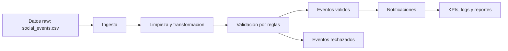
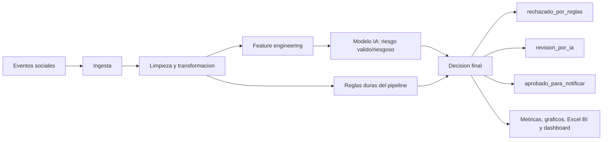

# NotifyOps - Entrega Parcial 3

Proyecto de Gestion de Datos para IA basado en el **Caso de Estudio 2: Motor de Notificaciones para una Red Social**.

NotifyOps parte del pipeline DataOps/ETL construido en Parcial 2 y lo mejora para Parcial 3 con:

- entrenamiento de un modelo de IA de clasificacion binaria;
- comparacion e interpretacion de metricas de rendimiento;
- auditoria de seguridad sobre datos sensibles y roles;
- fuente Excel lista para integrarse con Power BI;
- dashboard local complementario;
- automatizacion con Airflow y ejecucion reproducible con Docker.

El objetivo no es reemplazar el pipeline anterior. La mejora consiste en agregar una capa predictiva que ayuda a detectar eventos riesgosos antes de aprobar una notificacion.

```text
Pipeline ETL anterior + modelo IA + auditoria + BI = pipeline mejorado Parcial 3
```

## Contexto del caso

Una red social necesita enviar notificaciones sobre likes, comentarios y seguidores. El producto cambia cada dos semanas segun metricas y feedback, por eso NotifyOps usa:

- ETL/DataOps para ordenar, limpiar y validar eventos;
- Airflow con frecuencia quincenal para representar el ciclo de mejora;
- IA para estimar riesgo de eventos antes de notificar;
- Power BI/Excel para visualizar rendimiento y decisiones.

## Cambio principal respecto a Parcial 2

Antes, NotifyOps solo decidia con reglas duras:

- tipo de evento permitido;
- usuario origen y destino presentes;
- fecha valida;
- control de duplicados;
- generacion de notificaciones y KPIs.

Ahora, la entrega agrega IA:

- el modelo calcula una probabilidad de riesgo;
- las reglas duras siguen siendo obligatorias;
- la decision final combina reglas + IA;
- se incluye un Excel fijo y listo para importar en Power BI;
- se documentan seguridad, roles, limitaciones y mejoras.

El Excel BI se mantiene fijo de forma intencional. No es una dependencia interna del pipeline ni hace mas compleja la ejecucion: es la fuente de datos que el profesor puede abrir o importar directamente en Power BI para revisar metricas, seguridad y decisiones.

## Flujo antes de IA



## Flujo con IA integrada



La IA se ubica despues de limpiar y transformar los datos, porque ahi los registros ya estan normalizados y pueden convertirse en variables predictivas.

## Decision final

```text
Si fallan reglas duras        -> rechazado_por_reglas
Si pasan reglas + riesgo alto -> revision_por_ia
Si pasan reglas + riesgo bajo -> aprobado_para_notificar
```

Esto es importante para defender el proyecto: la IA no aprueba eventos que tienen errores objetivos. Primero se respetan reglas de calidad y luego se usa el modelo como apoyo predictivo.

## Comparativa antes y despues

| Aspecto | Parcial 2 | Parcial 3 |
|---|---|---|
| Objetivo | Procesar eventos y generar notificaciones | Optimizar el pipeline con IA, seguridad y BI |
| Decision | Reglas duras | Reglas duras + scoring IA |
| Evidencia | CSV, SQLite, KPIs, logs | Metricas IA, matriz de confusion, ROC, Gini, Excel BI, dashboard |
| Valor | Control operativo del pipeline | Analisis predictivo y visualizacion ejecutiva |
| Riesgo controlado | Datos invalidos evidentes | Eventos riesgosos, falsos positivos/negativos y datos sensibles |

## Checklist de rubrica cubierta

| Requisito Parcial 3 | Evidencia en el repositorio |
|---|---|
| Pipeline anterior mejorado | `src/notifyops/pipeline.py`, `dags/notifyops_etl_dag.py` |
| Entrenamiento modelo IA | `src/notifyops_ai/modeling.py` |
| Calidad y preprocesamiento | `data/reports/ai/quality_summary.csv`, `data/ai/feature_matrix.csv` |
| Analisis univariado/bivariado | `data/reports/ai/charts/`, `correlation_matrix.csv` |
| Metricas: confusion, accuracy, recall, Gini, ROC | `data/reports/ai/model_metrics.csv`, `confusion_matrix.csv`, `roc_curve.png` |
| Auditoria seguridad y roles | `data/bi/notifyops_powerbi_dataset.xlsx`, hojas `auditoria_seguridad` y `roles_acceso` |
| Integracion BI | `data/bi/notifyops_powerbi_dataset.xlsx`, hoja `guia_powerbi` y pasos de este README |
| Dashboard | `dashboard/notifyops_ai_dashboard.html` y fuente Power BI |
| Limitaciones y mejoras | Secciones `Limitaciones reconocidas` y `Mejoras propuestas` |
| Demo funcional | Comandos de ejecucion paso a paso en este README |

## Graficos y evidencias visuales incluidas

Los graficos solicitados para rendimiento, interpretacion y BI estan en:

```text
data/reports/ai/charts/
```

Archivos principales:

- `confusion_matrix.png`: matriz de confusion visual.
- `roc_curve.png`: curva ROC.
- `feature_weights.png`: variables mas influyentes del modelo.
- `correlation_matrix.png`: matriz de correlacion para analisis bivariado.
- `class_distribution.png`: distribucion de clases validas/riesgosas.
- `event_type_distribution.png`: distribucion por tipo de evento.
- `risk_by_event_type.png`: riesgo promedio por tipo de evento.
- `final_decision_distribution.png`: decisiones finales entre reglas e IA.

La fuente BI fija `data/bi/notifyops_powerbi_dataset.xlsx` incluye estos mismos resultados en formato tabular para construir el panel en Power BI.

## Instalacion

Clonar el repositorio:

```powershell
git clone https://github.com/vicentehueichapan/ProyecGEIA.git
cd ProyecGEIA
```

Instalar dependencias:

```powershell
pip install -r requirements.txt
```

## Ejecucion completa recomendada

Ejecutar desde la raiz del repositorio.

### 1. Ver datos originales antes de la ETL

```powershell
Import-Csv .\data\raw\social_events.csv | Format-Table -AutoSize
```

Los datos vienen mezclados, desordenados y con anomalias intencionales.

### 2. Ejecutar pruebas automatizadas

```powershell
python -m unittest discover -v
```

Resultado esperado:

```text
OK
```

### 3. Ejecutar pipeline DataOps/ETL

```powershell
python -m src.notifyops.pipeline
```

El pipeline genera datos procesados, validos, rechazados, notificaciones, KPIs, SQLite y logs.

### 4. Ver datos despues de la transformacion

```powershell
Import-Csv .\data\processed\events_processed.csv | Select-Object event_id,event_type,source_user_id,target_user_id,created_at,notification_text | Format-Table -AutoSize
```

### 5. Ver validos y rechazados

```powershell
Import-Csv .\data\validated\events_validated.csv | Select-Object event_id,event_type,source_user_id,target_user_id,created_at,notification_text | Format-Table -AutoSize
```

```powershell
Import-Csv .\data\reports\validation_errors.csv | Select-Object event_id,event_type,created_at,error_reason | Format-Table -AutoSize
```

### 6. Ver KPIs del pipeline

```powershell
Import-Csv .\data\reports\kpi_report.csv | Format-List
```

### 7. Ejecutar modelo IA y generar evidencia Parcial 3

```powershell
python -m src.notifyops_ai.modeling
```

Este comando entrena el modelo y regenera:

- dataset IA;
- matriz de variables;
- metricas del modelo;
- matriz de confusion;
- predicciones;
- decision final reglas + IA;
- graficos;
- modelo guardado;
- dashboard HTML.

El Excel de Power BI no se recalcula en este paso. Queda como artefacto fijo de entrega para que el profesor lo importe directamente y revise la integracion BI sin pasos extra.

### 8. Ver metricas del modelo

```powershell
Import-Csv .\data\reports\ai\model_metrics.csv | Format-List
```

Metricas esperadas en la ejecucion actual:

```text
accuracy: 0.9375
precision: 1.0
recall: 0.875
f1_score: 0.9333
roc_auc: 0.9594
gini: 0.9188
```

### 9. Ver matriz de confusion

```powershell
Import-Csv .\data\reports\ai\confusion_matrix.csv | Format-Table -AutoSize
```

### 10. Ver decision final integrada

```powershell
Import-Csv .\data\reports\ai\final_event_decisions.csv | Select-Object event_id,event_type,rule_error_reason,ai_risk_probability,ai_prediction,final_decision | Format-Table -AutoSize
```

Si PowerShell corta columnas:

```powershell
Import-Csv .\data\reports\ai\final_event_decisions.csv | Select-Object -First 5 | Format-List
```

### 11. Abrir dashboard local

Abrir en navegador:

```text
dashboard/notifyops_ai_dashboard.html
```

Este dashboard es complementario para revisar rapidamente metricas, graficos y resultados.

### 12. Usar Excel fijo para Power BI

Archivo:

```text
data/bi/notifyops_powerbi_dataset.xlsx
```

En Power BI Desktop:

1. Seleccionar `Obtener datos`.
2. Elegir `Excel`.
3. Cargar `data/bi/notifyops_powerbi_dataset.xlsx`.
4. Usar la hoja `guia_powerbi` para construir las visualizaciones.

Hojas principales:

- `metricas_modelo`: tarjetas KPI de rendimiento.
- `matriz_confusion`: matriz de confusion.
- `decisiones_finales`: salida integrada reglas + IA.
- `resumen_decisiones`: cantidad por decision final.
- `calidad_datos`: nulos, fechas invalidas, duplicados y tipos invalidos.
- `pesos_variables`: variables mas influyentes del modelo.
- `rendimiento_local`: KPIs del pipeline anterior.
- `auditoria_seguridad`: datos sensibles, riesgos y controles.
- `roles_acceso`: roles y restricciones.
- `guia_powerbi`: visuales recomendados.

No se requiere un README adicional para Power BI: las instrucciones estan en esta seccion y dentro de la hoja `guia_powerbi`.

## Airflow

Airflow se incluye como complemento de automatizacion ETL. El DAG no reemplaza el pipeline Python: lo orquesta.

```powershell
docker compose -f docker-compose.airflow.yml up
```

Luego abrir:

```text
http://localhost:8080
```

Credenciales de demo:

```text
usuario: admin
clave: admin
```

DAG:

```text
notifyops_etl_dag
```

El DAG queda configurado con frecuencia quincenal para representar el ciclo de experimentacion del caso:

```text
schedule=timedelta(weeks=2)
```

Apagar Airflow:

```powershell
docker compose -f docker-compose.airflow.yml down -v --remove-orphans
```

El compose no tiene reinicio automatico; el proyecto no queda configurado para prenderse solo.

## Docker

```powershell
docker build -t notifyops-mvp .
docker run --rm notifyops-mvp
```

Para regenerar resultados en la carpeta local:

```powershell
docker run --rm -v "${PWD}\data:/app/data" -v "${PWD}\logs:/app/logs" notifyops-mvp
```

## Archivos principales

- `src/notifyops/pipeline.py`: pipeline ETL/DataOps de Parcial 2.
- `dags/notifyops_etl_dag.py`: automatizacion Airflow.
- `src/notifyops_ai/modeling.py`: entrenamiento del modelo IA.
- `tests/test_pipeline.py`: pruebas del pipeline.
- `tests/test_airflow_dag.py`: pruebas del DAG.
- `tests/test_notifyops_ai.py`: pruebas de IA, decision final y existencia del Excel BI.
- `data/raw/social_events.csv`: datos originales.
- `data/reports/ai/model_metrics.csv`: metricas del modelo.
- `data/reports/ai/confusion_matrix.csv`: matriz de confusion.
- `data/reports/ai/final_event_decisions.csv`: decision final integrada.
- `data/reports/ai/charts/`: graficos para informe y presentacion.
- `data/bi/notifyops_powerbi_dataset.xlsx`: fuente fija BI lista para Power BI.
- `dashboard/notifyops_ai_dashboard.html`: dashboard local complementario.
- `models/notifyops_ai_model.json`: modelo guardado.

## Auditoria de seguridad

La auditoria se documenta en el Excel BI y considera:

- datos sensibles: `source_user_id`, `target_user_id`, `content`, `created_at`;
- riesgos: reidentificacion, inferencia de relaciones, exposicion de texto y trazabilidad;
- controles: pseudonimizacion, acceso por rol, visualizacion agregada, minimizacion de datos y revision de logs;
- roles: Administrador DataOps, Analista BI, Auditor/Profesor y Usuario negocio;
- alineacion general con la Ley 19.628 de proteccion de datos personales en Chile.

## Limitaciones reconocidas

- El dataset IA es sintetico porque el caso academico no entrega historicos reales de produccion.
- El dashboard Power BI se construye importando el Excel generado; el repositorio entrega la fuente BI y la guia de visuales.
- El entorno es local/Docker, no una nube productiva real.
- El modelo se usa como apoyo predictivo; las reglas duras siguen siendo obligatorias.

## Mejoras propuestas

- Reentrenar el modelo cada dos semanas junto al ciclo de experimentacion del producto.
- Conectar Power BI a una base o almacenamiento compartido en vez de Excel local.
- Agregar monitoreo de drift y alertas si baja el recall o sube la tasa de errores.
- Reemplazar dataset sintetico por historicos reales anonimizados.
- Aplicar control de acceso formal sobre dashboard, logs y datos sensibles.

## Defensa breve

NotifyOps demuestra la evolucion del pipeline de Parcial 2 hacia una solucion de Parcial 3. Primero procesa eventos sociales con una ETL validada por pruebas. Luego agrega un modelo IA que clasifica eventos como `valido` o `riesgoso`. La decision final combina reglas duras y probabilidad de riesgo, por lo que el sistema mantiene control de calidad y agrega inteligencia predictiva.

La integracion BI se resuelve mediante `data/bi/notifyops_powerbi_dataset.xlsx`, que contiene metricas, matriz de confusion, decisiones finales, rendimiento local, auditoria de seguridad, roles y guia de graficos. Con esto el profesor puede ejecutar el proyecto, revisar evidencia tecnica y construir o validar el dashboard en Power BI.
