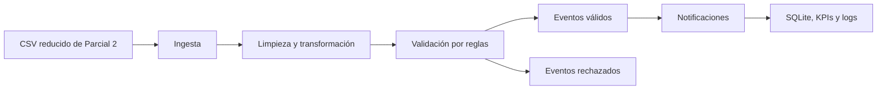
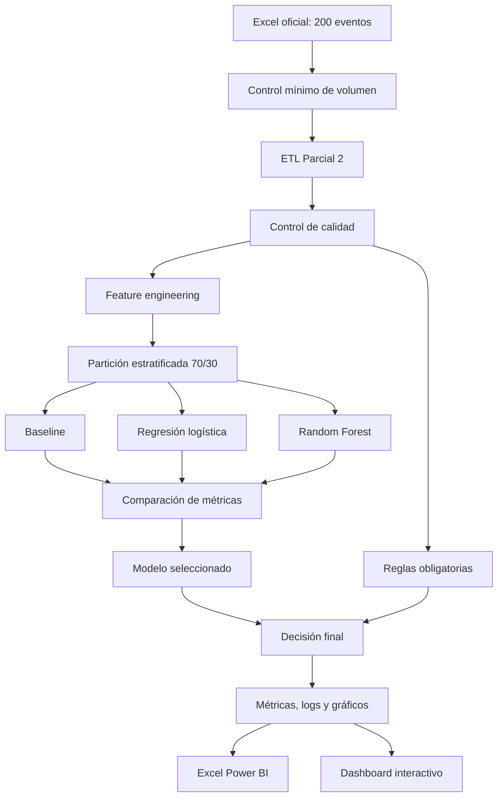
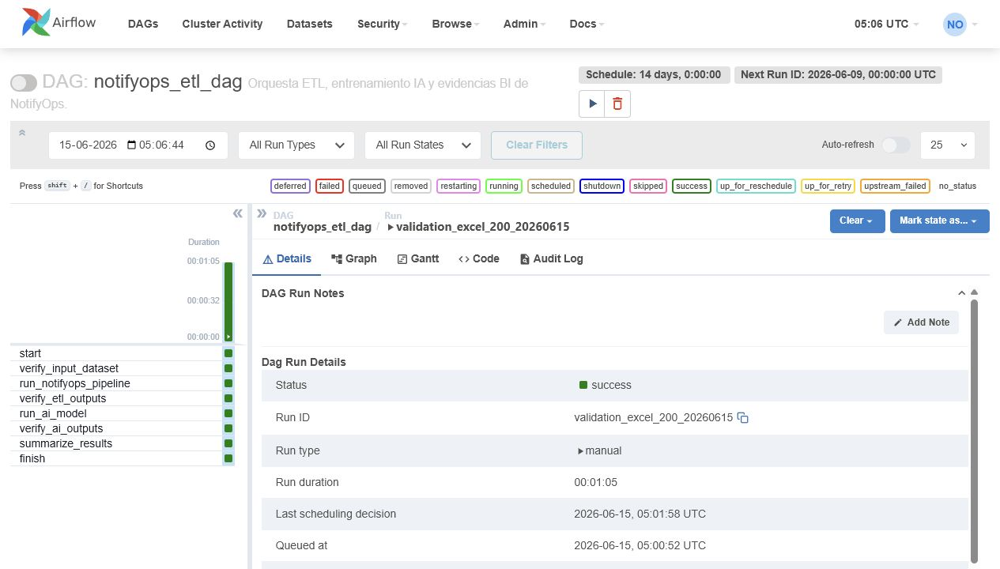

# NotifyOps - Proyecto Final DataOps con IA, BI y Estrategia EFT

Proyecto de **Gestión de Datos para IA** basado en el Caso de Estudio 2:
Motor de Notificaciones para una Red Social.

NotifyOps no es un proyecto nuevo. Esta entrega conserva el pipeline ETL
funcional desarrollado en la Evaluación Parcial 2 y demuestra su evolución en
la Evaluación Parcial 3, y agrega en la Evaluación Final Transversal (EFT) una capa empresarial de infraestructura, monitoreo, gobernanza y despliegue mediante:

- análisis estadístico de calidad de datos;
- entrenamiento y comparación de tres modelos;
- decisiones combinadas entre reglas obligatorias e IA;
- mediciones reales de rendimiento local;
- auditoría de seguridad, seudonimización y roles;
- automatización completa con Apache Airflow;
- fuente Excel compatible con Power BI;
- dashboard BI local interactivo y reproducible;
- notebook ejecutado y evidencias visuales verificables.
- Excel oficial con 200 eventos usado realmente por ETL e IA;
- requerimiento de infraestructura nube/on-premise;
- estrategia de monitoreo continuo;
- protocolos de gobernanza y seguridad;
- estrategia de despliegue organizacional.

```text
Pipeline ETL Parcial 2 + IA/BI Parcial 3 + infraestructura/monitoreo/gobernanza EFT
= Proyecto final DataOps defendible
```

## Índice

1. [Contexto y objetivo](#contexto-y-objetivo)
2. [Evolución del proyecto](#evolución-del-proyecto)
3. [Capa EFT: infraestructura, monitoreo, gobernanza y despliegue](#capa-eft-infraestructura-monitoreo-gobernanza-y-despliegue)
4. [Arquitectura](#arquitectura)
5. [Resultados verificados](#resultados-verificados)
6. [Ejecución completa](#ejecución-completa)
7. [Dashboard BI y Power BI](#dashboard-bi-y-power-bi)
8. [Automatización con Airflow](#automatización-con-airflow)
9. [Docker del MVP](#docker-del-mvp)
10. [Seguridad y protección de datos](#seguridad-y-protección-de-datos)
11. [Evidencias de cumplimiento](#evidencias-de-cumplimiento)
12. [Estructura del repositorio](#estructura-del-repositorio)
13. [Limitaciones y mejoras](#limitaciones-y-mejoras)
14. [Secuencia recomendada para la demo EFT](#secuencia-recomendada-para-la-demo-eft)

## Contexto y objetivo

Una red social necesita procesar eventos `like`, `comment` y `follow` para
generar notificaciones confiables. El producto experimenta cada dos semanas,
por lo que el sistema debe entregar resultados repetibles, métricas y
evidencias que permitan evaluar cambios sin perder control de calidad.

NotifyOps aplica:

- **DataOps/ETL:** ingesta, limpieza, validación, carga y monitoreo.
- **Airflow:** orquestación quincenal del pipeline completo.
- **IA:** estimación de riesgo basada en estructura y comportamiento.
- **BI:** análisis interactivo de rendimiento, decisiones y seguridad.

La IA no reemplaza las reglas obligatorias. Un evento con fecha inválida,
usuario ausente, duplicidad o tipo no permitido nunca puede ser aprobado por
el modelo.

## Evolución del proyecto

| Componente | Parcial 2 | Parcial 3 |
|---|---|---|
| Ingesta y ETL | CSV pequeño, limpieza y transformación | Excel fijo de 200 eventos, validación de volumen y rendimiento real |
| Calidad | Validaciones estructurales | Nulos, duplicados, percentiles, media, mediana, moda e imputación |
| Decisión | Reglas duras | Reglas duras + probabilidad de riesgo IA |
| Modelos | No aplicaba | Baseline, regresión logística y Random Forest |
| Métricas | KPIs operacionales | Accuracy, precisión, recall, F1, ROC-AUC, Gini y matrices |
| Rendimiento | Latencia simulada del MVP | Tiempo real de ETL, entrenamiento e inferencia |
| Automatización | DAG ETL | DAG ETL + IA + BI + verificación de salidas |
| Seguridad | Validación básica | Seudonimización, minimización, activos, controles y roles |
| Visualización | CSV y reportes | Dashboard interactivo + Excel para Power BI |
| Evidencia | Ejecución y KPIs | Notebook ejecutado, gráficos, capturas, CSV, JSON y Excel |

### Problemas resueltos en Parcial 3

- La etiqueta histórica dejó de ser aleatoria: ahora depende de velocidad de
  interacción, antigüedad de cuenta y tasa histórica de reportes, con
  incertidumbre controlada propia de una revisión humana histórica.
- La fuente de prueba dejó de recrearse en cada ejecución: el archivo
  `data/raw/social_events_200.xlsx` queda versionado y es consumido por ETL e IA.
- El pipeline detiene la ejecución si la fuente contiene menos de 200 filas.
- La IA produce una acción diferenciada: `revision_por_ia`.
- Los modelos se comparan bajo la misma partición estratificada 70/30.
- El Excel BI se entrega preconstruido y versionado; una ejecución completa
  puede actualizarlo desde los mismos CSV finales para comprobar consistencia.
- Los identificadores de usuarios se seudonimizan antes de exportarlos a BI.
- Airflow ejecuta y verifica tanto ETL como IA y artefactos BI.
- La latencia simulada se diferencia de las mediciones reales del sistema.


## Capa EFT: infraestructura, monitoreo, gobernanza y despliegue

La Evaluación Final Transversal no reemplaza el MVP ni la extensión de IA. Agrega una lectura empresarial del mismo sistema para explicar cómo se operaría en una organización real.

| Requisito EFT | Propuesta en NotifyOps | Evidencia en el repositorio |
|---|---|---|
| Metodología PMBOK | Alcance, calidad, riesgos, comunicaciones y cierre del proyecto | Informe EFT y esta guía |
| Infraestructura | MVP local con ruta a staging/producción: Docker, Airflow, PostgreSQL, almacenamiento y BI | `docker-compose.airflow.yml`, `Dockerfile`, `README.md` |
| Monitoreo | Métricas de disponibilidad, calidad, rendimiento, IA y seguridad; propuesta Prometheus/Grafana y CI | `logs/`, `kpi_report.csv`, `performance_summary.csv`, Airflow |
| Gobernanza | Roles, minimización, seudonimización, auditoría y control de accesos | `src/notifyops_ai/bi_dataset.py`, dashboard, Excel BI |
| Seguridad | Protección de datos personales, Ley 19.628 y Ley 21.719, exclusión de contenido sensible | Sección seguridad y `data/bi/notifyops_powerbi_dataset.xlsx` |
| Despliegue | Piloto, staging, producción limitada y operación continua quincenal | DAG quincenal y estrategia documentada |

### Infraestructura propuesta

```text
MVP local: Python + Docker + Airflow standalone + SQLite/CSV/Excel
Staging: contenedores + PostgreSQL + pruebas automáticas + dashboard conectado
Producción: Airflow administrado, almacenamiento central, IAM, backups y monitoreo
```

La arquitectura mantiene el mismo flujo lógico validado: entrada de eventos, ETL, reglas, modelo IA, reportes BI y orquestación. La mejora EFT consiste en definir recursos, disponibilidad, escalabilidad y gobierno para una implantación real.

### Estrategia de monitoreo

| Dimensión | Métrica o alerta | Acción esperada |
|---|---|---|
| Disponibilidad | DAG fallido, contenedor caído, dashboard inaccesible | Alerta al equipo DataOps y reintento controlado |
| Calidad | Menos de 200 filas, nulos críticos, tipos inválidos | Bloquear pipeline y generar reporte de error |
| Rendimiento | ETL o inferencia sobre umbral histórico | Revisar volumen, código y recursos |
| IA | Caída de recall, F1, ROC-AUC o aumento de revisión por IA | Analizar drift y reentrenar |
| Seguridad | Acceso indebido o exposición de datos sensibles | Revocar acceso, auditar logs y activar protocolo |

Herramientas propuestas para una organización: Prometheus/Grafana para métricas y alertas, Jenkins o GitHub Actions para validación previa al despliegue, y revisión periódica de logs y drift del modelo.

### Seguridad y gobernanza EFT

- Seudonimización SHA-256 de usuarios antes de BI.
- Exclusión del contenido textual del dataset BI.
- Roles sugeridos: DataOps, Analista BI, Auditor, Producto y Administrador.
- Acceso mínimo necesario y trazabilidad de evidencias.
- Gestión de secretos fuera del repositorio.
- Alineación con Ley 19.628 y Ley 21.719.

### Estrategia de despliegue organizacional

1. Piloto académico: validar con 200 eventos, pruebas, métricas y dashboard.
2. Staging: conectar fuente controlada, ejecutar DAG programado y revisar alertas.
3. Producción limitada: procesar eventos reales con revisión humana de casos riesgosos.
4. Operación continua: reentrenar, auditar y mejorar cada dos semanas.


## Arquitectura

### Arquitectura Parcial 2



### Arquitectura mejorada Parcial 3



### Decisión final

```text
Falla una regla obligatoria       -> rechazado_por_reglas
Pasa reglas y riesgo IA >= 0.50   -> revision_por_ia
Pasa reglas y riesgo IA < 0.50    -> aprobado_para_notificar
```

## Resultados verificados

La ejecución oficial usa exactamente 200 eventos versionados en
`data/raw/social_events_200.xlsx`. La partición usa semilla `42` para que los
resultados sean reproducibles.

### Comparación de modelos

| Modelo | Accuracy | Precisión | Recall | F1 | ROC-AUC | Gini | Selección |
|---|---:|---:|---:|---:|---:|---:|---|
| Baseline clase mayoritaria | 0.5167 | 0.5167 | 1.0000 | 0.6813 | 0.5000 | 0.0000 | No |
| Regresión logística | 0.8833 | 0.9286 | 0.8387 | 0.8814 | 0.9711 | 0.9422 | No |
| Random Forest | 0.9500 | 0.9118 | 1.0000 | 0.9538 | 0.9967 | 0.9933 | Sí |

Random Forest queda seleccionado porque obtiene el mayor F1 y recall completo
en la muestra de prueba. La regresión logística se conserva como alternativa
interpretable y permite contrastar el costo entre explicabilidad y rendimiento.

### Matriz de confusión del modelo seleccionado

| Clase real | Predicho válido | Predicho riesgoso |
|---|---:|---:|
| Válido | 26 | 3 |
| Riesgoso | 0 | 31 |

### Decisiones operacionales

| Decisión | Cantidad |
|---|---:|
| `rechazado_por_reglas` | 20 |
| `revision_por_ia` | 87 |
| `aprobado_para_notificar` | 93 |

### Calidad del dataset IA

| Indicador | Resultado |
|---|---:|
| Filas | 200 |
| Usuario origen ausente | 1 |
| Usuario destino ausente | 2 |
| Fechas inválidas | 2 |
| Duplicados | 0 |
| Tipos no permitidos | 16 |
| Eventos válidos | 97 |
| Eventos riesgosos | 103 |

La estrategia de imputación usa mediana para señales numéricas y conserva
indicadores explícitos para nulos estructurales. La ausencia de IDs duplicados
en la muestra oficial no elimina el control: la deduplicación se verifica en
las pruebas automatizadas.

### Alcance de las mediciones de rendimiento

Las mediciones entregadas corresponden a ejecuciones reales en entorno local y
contenedor Docker. La rúbrica plantea evaluación en entornos nube/local; este
proyecto demuestra el escenario local reproducible y no presenta estos
resultados como una prueba de infraestructura cloud.

## Ejecución completa

Todos los comandos se ejecutan desde la raíz del repositorio.

### 1. Clonar y entrar al proyecto

```powershell
git clone https://github.com/vicentehueichapan/ProyecGEIA.git
cd ProyecGEIA
```

Resultado esperado: la consola queda ubicada donde existen `README.md`,
`requirements.txt`, `src`, `tests` y `dags`.

### 2. Crear entorno e instalar dependencias

```powershell
python -m venv .venv
.\.venv\Scripts\Activate.ps1
python -m pip install --upgrade pip
python -m pip install -r requirements.txt
```

Resultado esperado: pandas, NumPy, matplotlib, scikit-learn, openpyxl y las
dependencias documentales quedan disponibles.

### 3. Ejecutar pruebas automatizadas

```powershell
python -m unittest discover -v
```

Resultado esperado:

```text
OK
```

Las 25 pruebas cubren ETL, Excel oficial, mínimo de 200 filas, SQLite, KPIs,
fechas, DAG, Compose, calidad, modelos, decisiones, Excel BI,
seudonimización y dashboard.

### 4. Ver datos antes de la ETL

```powershell
python -c "import pandas as pd; df=pd.read_excel(r'data/raw/social_events_200.xlsx', sheet_name='eventos'); print('Filas:', len(df)); print(df.head(20).to_string(index=False))"
```

Resultado esperado: `Filas: 200`. Los eventos están mezclados e incluyen
fechas inválidas, usuarios ausentes, tipos fuera del caso y señales
históricas para el modelo.

### 5. Ejecutar pipeline ETL

```powershell
python -m src.notifyops.pipeline
```

Genera:

```text
data/processed/events_processed.csv
data/validated/events_validated.csv
data/reports/validation_errors.csv
data/reports/notifications.csv
data/reports/kpi_report.csv
data/notifyops.db
logs/notifyops.log
```

### 6. Ver transformación, validación y KPIs

```powershell
Import-Csv .\data\processed\events_processed.csv |
    Select-Object event_id,event_type,source_user_id,target_user_id,created_at,notification_text |
    Format-Table -AutoSize

Import-Csv .\data\validated\events_validated.csv |
    Select-Object event_id,event_type,created_at,notification_text |
    Format-Table -AutoSize

Import-Csv .\data\reports\validation_errors.csv |
    Select-Object event_id,event_type,created_at,error_reason |
    Format-Table -AutoSize

Import-Csv .\data\reports\kpi_report.csv | Format-List
```

`avg_latency_seconds` es una simulación operacional del MVP.
`pipeline_execution_seconds` y `processing_rows_per_second` son mediciones
reales de la ejecución local.

### 7. Entrenar, comparar y generar evidencia Parcial 3

```powershell
python -m src.notifyops_ai.modeling
```

Este comando actualiza de forma determinista en una sola ejecución:

- lectura del mismo Excel oficial usado por la ETL;
- dataset de variables IA;
- análisis de calidad;
- comparación de tres modelos;
- métricas y matrices de confusión;
- puntos de curva ROC;
- rendimiento de entrenamiento e inferencia;
- decisiones reglas + IA;
- gráficos;
- modelo versionado;
- Excel BI;
- JSON y dashboard interactivo.

### 8. Revisar resultados IA

```powershell
Import-Csv .\data\reports\ai\model_comparison.csv |
    Format-Table model,accuracy,precision,recall,f1_score,roc_auc,gini,selected -AutoSize

Import-Csv .\data\reports\ai\model_metrics.csv | Format-List

Import-Csv .\data\reports\ai\confusion_matrix.csv | Format-Table -AutoSize

Import-Csv .\data\reports\ai\final_event_decisions.csv |
    Group-Object final_decision |
    Select-Object Name,Count |
    Format-Table -AutoSize
```

### 9. Abrir notebook ejecutado

```text
notebooks/modelo_validacion_eventos_notifyops.ipynb
```

El notebook entregado contiene todas sus celdas ejecutadas y explica calidad,
partición, análisis uni/bivariado, comparación, métricas, rendimiento,
seguridad, BI y limitaciones.

## Dashboard BI y Power BI

### Dashboard interactivo entregado

Iniciar un servidor local:

```powershell
python -m http.server 8000
```

Abrir:

```text
http://localhost:8000/dashboard/notifyops_ai_dashboard.html
```

El panel incluye:

- filtros por tipo de evento y decisión;
- tarjetas de métricas;
- decisiones y tipos de evento;
- comparación de modelos;
- calidad de datos;
- rendimiento medido;
- controles de seguridad y roles;
- vista responsive para móvil.


### Fuente compatible con Power BI

Archivo:

```text
data/bi/notifyops_powerbi_dataset.xlsx
```

El archivo ya viene construido en el repositorio y puede abrirse o importarse
sin ejecutar ningún comando previo. Al ejecutar el modelo se actualiza de forma
determinista para mantenerlo coherente con el Excel oficial y los CSV finales.
Contiene hojas
tabulares para:

- métricas y comparación;
- matriz de confusión y curva ROC;
- calidad y estadísticas;
- decisiones seudonimizadas;
- rendimiento ETL e IA;
- auditoría y roles;
- guía de páginas, visuales y campos.

En Power BI Desktop:

1. Seleccionar `Obtener datos`.
2. Elegir `Excel`.
3. Abrir `data/bi/notifyops_powerbi_dataset.xlsx`.
4. Cargar las hojas indicadas en `guia_powerbi`.
5. Crear las páginas `Resumen ejecutivo`, `Modelo y calidad` y
   `Seguridad y operación`.

El repositorio entrega una fuente tabular compatible con Power BI y un
dashboard BI local interactivo comprobado. No se incluye un archivo `.pbix`,
porque Power BI Desktop no estaba disponible para generarlo y validarlo; por
eso el README no afirma que dicho artefacto exista.

## Automatización con Airflow

Airflow orquesta:

```text
verificar entrada
-> ejecutar ETL
-> verificar ETL
-> entrenar y comparar IA
-> verificar métricas, Excel y dashboard
-> resumir resultados
```

Construir e iniciar en segundo plano:

```powershell
docker compose -f docker-compose.airflow.yml up --build -d
```

El primer arranque puede tardar entre 3 y 4 minutos mientras Airflow inicializa
su base y permisos. Para esta demostración local se usa el servidor `--debug`
de Airflow, que evita una incompatibilidad observada de Gunicorn en Docker
Desktop. No se utiliza para un despliegue productivo.

Verificar estado:

```powershell
docker compose -f docker-compose.airflow.yml ps
docker compose -f docker-compose.airflow.yml logs --tail=100 airflow
```

Abrir:

```text
http://localhost:8080
```

Credenciales académicas:

```text
usuario: admin
clave: admin
```

DAG:

```text
notifyops_etl_dag
```

El DAG se crea pausado para evitar ejecuciones automáticas al iniciar Docker.
Para una prueba controlada, actívalo, dispara una ejecución y consulta su
estado:

```powershell
docker compose -f docker-compose.airflow.yml exec airflow airflow dags unpause notifyops_etl_dag
docker compose -f docker-compose.airflow.yml exec airflow airflow dags trigger notifyops_etl_dag
docker compose -f docker-compose.airflow.yml exec airflow airflow dags list-runs -d notifyops_etl_dag
docker compose -f docker-compose.airflow.yml exec airflow airflow dags pause notifyops_etl_dag
```

Evidencia verificada el 15 de junio de 2026: `validation_excel_200_20260615`
terminó en `success`, con 8 de 8 tareas exitosas.



El detalle reproducible está en
`docs/evidencias/parcial3/05_airflow_validacion.txt`.

Programación:

```python
schedule=timedelta(weeks=2)
```

La frecuencia quincenal representa el ciclo de experimentación del caso. Si se
desea mantener la automatización activa después de la demostración:

```powershell
docker compose -f docker-compose.airflow.yml exec airflow airflow dags unpause notifyops_etl_dag
```

Para volver al modo controlado:

```powershell
docker compose -f docker-compose.airflow.yml exec airflow airflow dags pause notifyops_etl_dag
```

Apagar completamente:

```powershell
docker compose -f docker-compose.airflow.yml down -v --remove-orphans
```

No existe una política `restart` automática.

## Docker del MVP

Para ejecutar solamente la ETL:

```powershell
docker build -t notifyops-mvp .
docker run --rm notifyops-mvp
```

Para escribir resultados en la carpeta local:

```powershell
docker run --rm `
    -v "${PWD}\data:/app/data" `
    -v "${PWD}\logs:/app/logs" `
    notifyops-mvp
```

## Seguridad y protección de datos

### Controles implementados

- Seudonimización SHA-256 de usuarios antes de exportar decisiones a BI.
- Exclusión del contenido textual del dataset BI.
- Visualización principalmente agregada.
- Separación de roles y restricciones.
- Logs sin contraseñas ni contenido de usuarios.
- Versionamiento de modelo, métricas, partición y fecha.

### Datos considerados

| Activo | Sensibilidad | Tratamiento BI |
|---|---|---|
| `event_id` | Baja | Identificador técnico |
| `source_user_id` | Media | Clave seudonimizada |
| `target_user_id` | Media | Clave seudonimizada |
| `content` | Alta | Excluido |
| `created_at` | Media | Uso operacional y agregado |
| logs | Media | Acceso DataOps/Auditor |
| métricas | Baja | Evidencia técnica versionada |

La estrategia se alinea con finalidad, proporcionalidad, minimización,
seguridad y acceso limitado de la Ley 19.628. También se reconoce la Ley
21.719, publicada el 13 de diciembre de 2024 y cuya entrada en vigencia es el
1 de diciembre de 2026.

Referencias oficiales:

- [Ley 19.628 - BCN](https://www.bcn.cl/leychile/navegar?idNorma=141599)
- [Ley 21.719 - BCN](https://www.bcn.cl/leychile/navegar?idNorma=1209272)

## Evidencias de cumplimiento

| Requisito de la rúbrica | Evidencia verificable |
|---|---|
| Mínimo de 200 datos de prueba | `data/raw/social_events_200.xlsx`, prueba automatizada y tarea `verify_input_dataset` |
| Pipeline mejorado | `src/notifyops/pipeline.py`, `dags/notifyops_etl_dag.py` |
| Calidad e imputación | `data/reports/ai/quality_summary.csv`, notebook ejecutado |
| Análisis univariado | `data/reports/ai/charts/event_type_distribution.png`, notebook |
| Análisis bivariado | `data/reports/ai/charts/risk_by_event_type.png`, `data/reports/ai/charts/correlation_matrix.png` |
| Partición y entrenamiento | `src/notifyops_ai/modeling.py`, notebook, `data/reports/ai/performance_summary.csv` |
| Comparación de modelos | `data/reports/ai/model_comparison.csv`, `data/reports/ai/charts/model_comparison.png` |
| Accuracy, precisión, recall y F1 | `data/reports/ai/model_metrics.csv` |
| Matriz de confusión | `data/reports/ai/confusion_matrix.csv`, `data/reports/ai/charts/confusion_matrix.png` |
| ROC-AUC y Gini | `data/reports/ai/roc_curve_points.csv`, `data/reports/ai/charts/roc_curve.png` |
| Rendimiento | `data/reports/kpi_report.csv`, `data/reports/ai/performance_summary.csv`, `data/reports/ai/charts/runtime_comparison.png` |
| Seguridad y roles | `data/bi/notifyops_powerbi_dataset.xlsx`, dashboard, `src/notifyops_ai/bi_dataset.py` |
| Integración BI | `data/bi/notifyops_powerbi_dataset.xlsx` + `dashboard/notifyops_ai_dashboard.html` |
| Demo funcional | comandos de este README y DAG completo |
| Evidencia visual | `docs/evidencias/parcial3/` |
| Validación final | `docs/evidencias/parcial3/06_validacion_final.txt` |
| Limitaciones y mejoras | sección siguiente |

## Estructura del repositorio

```text
ProyecGEIA/
|-- dags/
|   `-- notifyops_etl_dag.py
|-- dashboard/
|   |-- data/dashboard_data.json
|   `-- notifyops_ai_dashboard.html
|-- data/
|   |-- ai/
|   |-- bi/notifyops_powerbi_dataset.xlsx
|   |-- processed/
|   |-- raw/social_events_200.xlsx
|   |-- reports/
|   `-- validated/
|-- docs/
|   `-- evidencias/parcial3/
|-- models/notifyops_ai_model.json
|-- notebooks/modelo_validacion_eventos_notifyops.ipynb
|-- src/
|   |-- notifyops/pipeline.py
|   `-- notifyops_ai/
|       |-- bi_dataset.py
|       `-- modeling.py
|-- tests/
|-- Dockerfile
|-- Dockerfile.airflow
|-- docker-compose.airflow.yml
|-- requirements.txt
`-- README.md
```

## Limitaciones y mejoras

### Limitaciones comprobadas

- El Excel de 200 eventos es una muestra académica fija porque no se entregaron
  históricos productivos.
- El volumen es académico y no representa tráfico masivo en tiempo real.
- El entorno evaluado es local/Docker, no una nube productiva.
- La latencia de entrega es simulada; ETL, entrenamiento e inferencia sí se
  miden realmente.
- El Excel está listo para Power BI, pero no se entrega un `.pbix`.
- La autenticación `admin/admin` es solo para la demostración local.

### Mejoras viables

- Sustituir la muestra académica por históricos anonimizados.
- Reentrenar quincenalmente y monitorear drift.
- Validar umbral de riesgo con costo de falsos negativos.
- Publicar el panel en Power BI Service o Metabase.
- Usar PostgreSQL y CeleryExecutor en una implantación productiva de Airflow.
- Gestionar secretos y permisos mediante un proveedor de identidad.
- Aplicar retención y auditoría formal de accesos.

## Secuencia recomendada para la demo EFT

1. Mostrar `data/raw/social_events_200.xlsx` y comprobar que contiene 200 filas.
2. Ejecutar las pruebas.
3. Ejecutar la ETL.
4. Mostrar válidos, rechazados y KPIs.
5. Ejecutar el modelo IA.
6. Mostrar comparación y explicar la selección.
7. Mostrar matriz de confusión, ROC y Gini.
8. Mostrar los tres estados de decisión.
9. Abrir el dashboard y aplicar dos filtros.
10. Mostrar seguridad, rendimiento y Excel BI.
11. Abrir Airflow y ejecutar el DAG.
12. Explicar infraestructura propuesta, monitoreo, gobernanza y despliegue EFT.
13. Cerrar con limitaciones y mejoras.

NotifyOps demuestra continuidad real entre evaluaciones: conserva la solución operacional de Parcial 2, agrega en Parcial 3 una capa analítica, predictiva, segura, automatizada y visual, y cierra en EFT con infraestructura, monitoreo, gobernanza y despliegue organizacional respaldados por código, pruebas y artefactos reproducibles.
