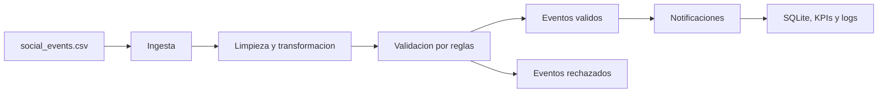
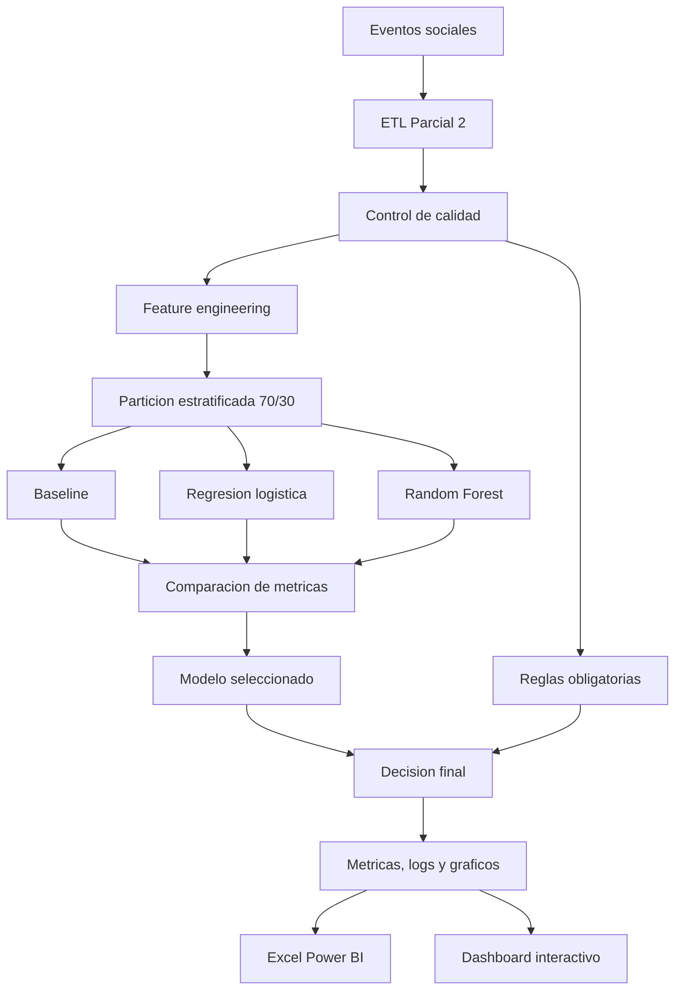
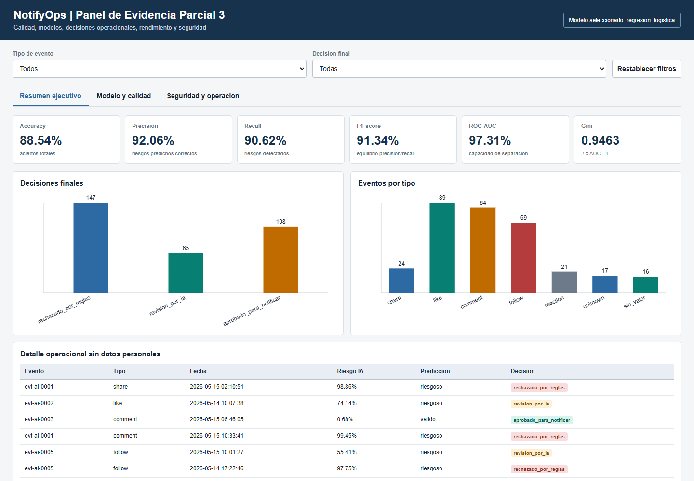
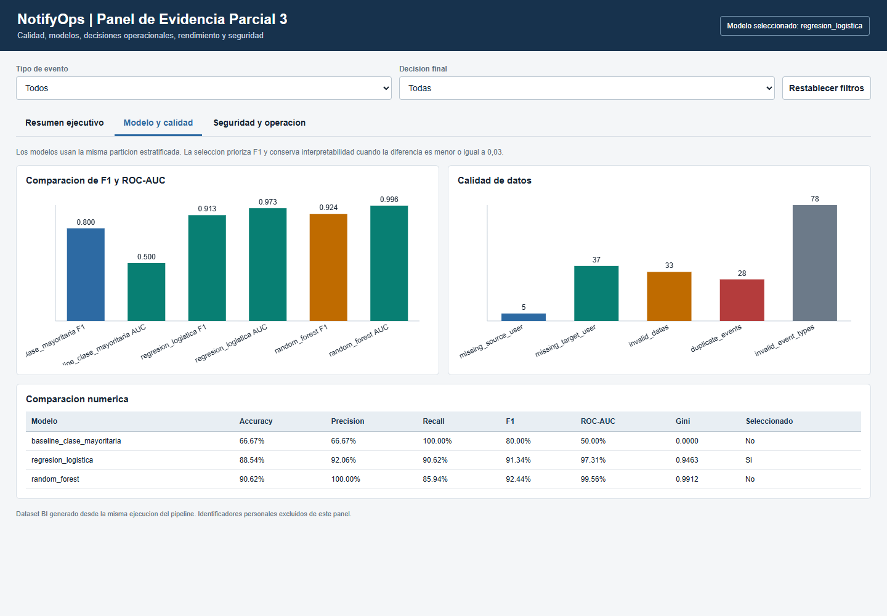
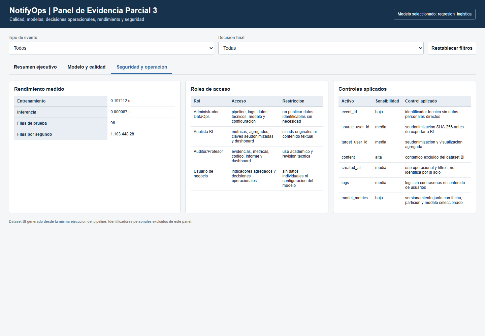

# NotifyOps - Evolucion del Pipeline DataOps con IA y BI

Proyecto de **Gestion de Datos para IA** basado en el Caso de Estudio 2:
Motor de Notificaciones para una Red Social.

NotifyOps no es un proyecto nuevo. Esta entrega conserva el pipeline ETL
funcional desarrollado en la Evaluacion Parcial 2 y demuestra su evolucion en
la Evaluacion Parcial 3 mediante:

- analisis estadistico de calidad de datos;
- entrenamiento y comparacion de tres modelos;
- decisiones combinadas entre reglas obligatorias e IA;
- mediciones reales de rendimiento local;
- auditoria de seguridad, seudonimizacion y roles;
- automatizacion completa con Apache Airflow;
- fuente Excel compatible con Power BI;
- dashboard BI local interactivo y reproducible;
- notebook ejecutado y evidencias visuales verificables.

```text
Pipeline ETL Parcial 2 + calidad + IA + seguridad + rendimiento + BI
= Pipeline mejorado Parcial 3
```

## Indice

1. [Contexto y objetivo](#contexto-y-objetivo)
2. [Evolucion del proyecto](#evolucion-del-proyecto)
3. [Arquitectura](#arquitectura)
4. [Resultados verificados](#resultados-verificados)
5. [Ejecucion completa](#ejecucion-completa)
6. [Dashboard BI y Power BI](#dashboard-bi-y-power-bi)
7. [Automatizacion con Airflow](#automatizacion-con-airflow)
8. [Docker del MVP](#docker-del-mvp)
9. [Seguridad y proteccion de datos](#seguridad-y-proteccion-de-datos)
10. [Evidencias de cumplimiento](#evidencias-de-cumplimiento)
11. [Estructura del repositorio](#estructura-del-repositorio)
12. [Limitaciones y mejoras](#limitaciones-y-mejoras)
13. [Secuencia recomendada para la demo](#secuencia-recomendada-para-la-demo)

## Contexto y objetivo

Una red social necesita procesar eventos `like`, `comment` y `follow` para
generar notificaciones confiables. El producto experimenta cada dos semanas,
por lo que el sistema debe entregar resultados repetibles, metricas y
evidencias que permitan evaluar cambios sin perder control de calidad.

NotifyOps aplica:

- **DataOps/ETL:** ingesta, limpieza, validacion, carga y monitoreo.
- **Airflow:** orquestacion quincenal del pipeline completo.
- **IA:** estimacion de riesgo basada en estructura y comportamiento.
- **BI:** analisis interactivo de rendimiento, decisiones y seguridad.

La IA no reemplaza las reglas obligatorias. Un evento con fecha invalida,
usuario ausente, duplicidad o tipo no permitido nunca puede ser aprobado por
el modelo.

## Evolucion del proyecto

| Componente | Parcial 2 | Parcial 3 |
|---|---|---|
| Ingesta y ETL | CSV, limpieza y transformacion | Se conserva y se mide su rendimiento real |
| Calidad | Validaciones estructurales | Nulos, duplicados, percentiles, media, mediana, moda e imputacion |
| Decision | Reglas duras | Reglas duras + probabilidad de riesgo IA |
| Modelos | No aplicaba | Baseline, regresion logistica y Random Forest |
| Metricas | KPIs operacionales | Accuracy, precision, recall, F1, ROC-AUC, Gini y matrices |
| Rendimiento | Latencia simulada del MVP | Tiempo real de ETL, entrenamiento e inferencia |
| Automatizacion | DAG ETL | DAG ETL + IA + BI + verificacion de salidas |
| Seguridad | Validacion basica | Seudonimizacion, minimizacion, activos, controles y roles |
| Visualizacion | CSV y reportes | Dashboard interactivo + Excel para Power BI |
| Evidencia | Ejecucion y KPIs | Notebook ejecutado, graficos, capturas, CSV, JSON y Excel |

### Problemas resueltos en Parcial 3

- La etiqueta historica dejo de ser aleatoria: ahora depende de velocidad de
  interaccion, antiguedad de cuenta y tasa historica de reportes.
- La IA produce una accion diferenciada: `revision_por_ia`.
- Los modelos se comparan bajo la misma particion estratificada 70/30.
- El Excel BI se entrega preconstruido y versionado; una ejecucion completa
  puede actualizarlo desde los mismos CSV finales para comprobar consistencia.
- Los identificadores de usuarios se seudonimizan antes de exportarlos a BI.
- Airflow ejecuta y verifica tanto ETL como IA y artefactos BI.
- La latencia simulada se diferencia de las mediciones reales del sistema.

## Arquitectura

### Arquitectura Parcial 2



### Arquitectura mejorada Parcial 3



### Decision final

```text
Falla una regla obligatoria       -> rechazado_por_reglas
Pasa reglas y riesgo IA >= 0.50   -> revision_por_ia
Pasa reglas y riesgo IA < 0.50    -> aprobado_para_notificar
```

## Resultados verificados

La ejecucion determinista usa `rows=320` y `seed=42`.

### Comparacion de modelos

| Modelo | Accuracy | Precision | Recall | F1 | ROC-AUC | Gini | Seleccion |
|---|---:|---:|---:|---:|---:|---:|---|
| Baseline clase mayoritaria | 0.6667 | 0.6667 | 1.0000 | 0.8000 | 0.5000 | 0.0000 | No |
| Regresion logistica | 0.8854 | 0.9206 | 0.9062 | 0.9134 | 0.9731 | 0.9463 | Si |
| Random Forest | 0.9062 | 1.0000 | 0.8594 | 0.9244 | 0.9956 | 0.9912 | No |

La regresion logistica queda seleccionada porque su F1 esta a menos de `0.03`
del mejor resultado y permite explicar con mayor claridad el peso y direccion
de las variables. Random Forest obtiene mejor F1 global, pero menor recall que
la regresion; en este caso es importante detectar eventos riesgosos.

### Matriz de confusion del modelo seleccionado

| Clase real | Predicho valido | Predicho riesgoso |
|---|---:|---:|
| Valido | 27 | 5 |
| Riesgoso | 6 | 58 |

### Decisiones operacionales

| Decision | Cantidad |
|---|---:|
| `rechazado_por_reglas` | 147 |
| `revision_por_ia` | 65 |
| `aprobado_para_notificar` | 108 |

### Calidad del dataset IA

| Indicador | Resultado |
|---|---:|
| Filas | 320 |
| Usuario origen ausente | 5 |
| Usuario destino ausente | 37 |
| Fechas invalidas | 33 |
| Duplicados | 28 |
| Tipos no permitidos | 78 |
| Eventos validos | 105 |
| Eventos riesgosos | 215 |

La estrategia de imputacion usa mediana para senales numericas y conserva
indicadores explicitos para nulos estructurales.

### Alcance de las mediciones de rendimiento

Las mediciones entregadas corresponden a ejecuciones reales en entorno local y
contenedor Docker. La rubrica plantea evaluacion en entornos nube/local; este
proyecto demuestra el escenario local reproducible y no presenta estos
resultados como una prueba de infraestructura cloud.

## Ejecucion completa

Todos los comandos se ejecutan desde la raiz del repositorio.

### 1. Clonar y entrar al proyecto

```powershell
git clone https://github.com/vicentehueichapan/ProyecGEIA.git
cd ProyecGEIA
```

Resultado esperado: la consola queda ubicada donde existen `README.md`,
`requirements.txt`, `src`, `tests` y `dags`.

### 2. Crear entorno e instalar dependencias

```powershell
python -m venv .venv
.\.venv\Scripts\Activate.ps1
python -m pip install --upgrade pip
python -m pip install -r requirements.txt
```

Resultado esperado: pandas, NumPy, matplotlib, scikit-learn, openpyxl y las
dependencias documentales quedan disponibles.

### 3. Ejecutar pruebas automatizadas

```powershell
python -m unittest discover -v
```

Resultado esperado:

```text
OK
```

Las pruebas cubren ETL, SQLite, KPIs, fechas, DAG, Compose, calidad, modelos,
decisiones, Excel BI, seudonimizacion y dashboard.

### 4. Ver datos antes de la ETL

```powershell
Import-Csv .\data\raw\social_events.csv | Format-Table -AutoSize
```

Los eventos estan mezclados e incluyen duplicados, fechas invalidas, usuarios
ausentes y tipos fuera del caso.

### 5. Ejecutar pipeline ETL

```powershell
python -m src.notifyops.pipeline
```

Genera:

```text
data/processed/events_processed.csv
data/validated/events_validated.csv
data/reports/validation_errors.csv
data/reports/notifications.csv
data/reports/kpi_report.csv
data/notifyops.db
logs/notifyops.log
```

### 6. Ver transformacion, validacion y KPIs

```powershell
Import-Csv .\data\processed\events_processed.csv |
    Select-Object event_id,event_type,source_user_id,target_user_id,created_at,notification_text |
    Format-Table -AutoSize

Import-Csv .\data\validated\events_validated.csv |
    Select-Object event_id,event_type,created_at,notification_text |
    Format-Table -AutoSize

Import-Csv .\data\reports\validation_errors.csv |
    Select-Object event_id,event_type,created_at,error_reason |
    Format-Table -AutoSize

Import-Csv .\data\reports\kpi_report.csv | Format-List
```

`avg_latency_seconds` es una simulacion operacional del MVP.
`pipeline_execution_seconds` y `processing_rows_per_second` son mediciones
reales de la ejecucion local.

### 7. Entrenar, comparar y generar evidencia Parcial 3

```powershell
python -m src.notifyops_ai.modeling
```

Este comando actualiza de forma determinista en una sola ejecucion:

- dataset y variables IA;
- analisis de calidad;
- comparacion de tres modelos;
- metricas y matrices de confusion;
- puntos de curva ROC;
- rendimiento de entrenamiento e inferencia;
- decisiones reglas + IA;
- graficos;
- modelo versionado;
- Excel BI;
- JSON y dashboard interactivo.

### 8. Revisar resultados IA

```powershell
Import-Csv .\data\reports\ai\model_comparison.csv |
    Format-Table model,accuracy,precision,recall,f1_score,roc_auc,gini,selected -AutoSize

Import-Csv .\data\reports\ai\model_metrics.csv | Format-List

Import-Csv .\data\reports\ai\confusion_matrix.csv | Format-Table -AutoSize

Import-Csv .\data\reports\ai\final_event_decisions.csv |
    Group-Object final_decision |
    Select-Object Name,Count |
    Format-Table -AutoSize
```

### 9. Abrir notebook ejecutado

```text
notebooks/modelo_validacion_eventos_notifyops.ipynb
```

El notebook entregado contiene todas sus celdas ejecutadas y explica calidad,
particion, analisis uni/bivariado, comparacion, metricas, rendimiento,
seguridad, BI y limitaciones.

## Dashboard BI y Power BI

### Dashboard interactivo entregado

Iniciar un servidor local:

```powershell
python -m http.server 8000
```

Abrir:

```text
http://localhost:8000/dashboard/notifyops_ai_dashboard.html
```

El panel incluye:

- filtros por tipo de evento y decision;
- tarjetas de metricas;
- decisiones y tipos de evento;
- comparacion de modelos;
- calidad de datos;
- rendimiento medido;
- controles de seguridad y roles;
- vista responsive para movil.







### Fuente compatible con Power BI

Archivo:

```text
data/bi/notifyops_powerbi_dataset.xlsx
```

El archivo ya viene construido en el repositorio y puede abrirse o importarse
sin ejecutar ningun comando previo. Al ejecutar el modelo se actualiza de forma
determinista para mantenerlo coherente con los CSV finales. Contiene hojas
tabulares para:

- metricas y comparacion;
- matriz de confusion y curva ROC;
- calidad y estadisticas;
- decisiones seudonimizadas;
- rendimiento ETL e IA;
- auditoria y roles;
- guia de paginas, visuales y campos.

En Power BI Desktop:

1. Seleccionar `Obtener datos`.
2. Elegir `Excel`.
3. Abrir `data/bi/notifyops_powerbi_dataset.xlsx`.
4. Cargar las hojas indicadas en `guia_powerbi`.
5. Crear las paginas `Resumen ejecutivo`, `Modelo y calidad` y
   `Seguridad y operacion`.

El repositorio entrega una fuente tabular compatible con Power BI y un
dashboard BI local interactivo comprobado. No se incluye un archivo `.pbix`,
porque Power BI Desktop no estaba disponible para generarlo y validarlo; por
eso el README no afirma que dicho artefacto exista.

## Automatizacion con Airflow

Airflow orquesta:

```text
verificar entrada
-> ejecutar ETL
-> verificar ETL
-> entrenar y comparar IA
-> verificar metricas, Excel y dashboard
-> resumir resultados
```

Construir e iniciar en segundo plano:

```powershell
docker compose -f docker-compose.airflow.yml up --build -d
```

Verificar estado:

```powershell
docker compose -f docker-compose.airflow.yml ps
docker compose -f docker-compose.airflow.yml logs --tail=100 airflow
```

Abrir:

```text
http://localhost:8080
```

Credenciales academicas:

```text
usuario: admin
clave: admin
```

DAG:

```text
notifyops_etl_dag
```

El DAG se crea pausado para evitar ejecuciones automaticas al iniciar Docker.
Para una prueba controlada, despausarlo, disparar una ejecucion y consultar su
estado:

```powershell
docker compose -f docker-compose.airflow.yml exec airflow airflow dags unpause notifyops_etl_dag
docker compose -f docker-compose.airflow.yml exec airflow airflow dags trigger notifyops_etl_dag
docker compose -f docker-compose.airflow.yml exec airflow airflow dags list-runs -d notifyops_etl_dag
docker compose -f docker-compose.airflow.yml exec airflow airflow dags pause notifyops_etl_dag
```

Programacion:

```python
schedule=timedelta(weeks=2)
```

La frecuencia quincenal representa el ciclo de experimentacion del caso. Si se
desea mantener la automatizacion activa despues de la demostracion:

```powershell
docker compose -f docker-compose.airflow.yml exec airflow airflow dags unpause notifyops_etl_dag
```

Para volver al modo controlado:

```powershell
docker compose -f docker-compose.airflow.yml exec airflow airflow dags pause notifyops_etl_dag
```

Apagar completamente:

```powershell
docker compose -f docker-compose.airflow.yml down -v --remove-orphans
```

No existe una politica `restart` automatica.

## Docker del MVP

Para ejecutar solamente la ETL:

```powershell
docker build -t notifyops-mvp .
docker run --rm notifyops-mvp
```

Para escribir resultados en la carpeta local:

```powershell
docker run --rm `
    -v "${PWD}\data:/app/data" `
    -v "${PWD}\logs:/app/logs" `
    notifyops-mvp
```

## Seguridad y proteccion de datos

### Controles implementados

- Seudonimizacion SHA-256 de usuarios antes de exportar decisiones a BI.
- Exclusion del contenido textual del dataset BI.
- Visualizacion principalmente agregada.
- Separacion de roles y restricciones.
- Logs sin contrasenas ni contenido de usuarios.
- Versionamiento de modelo, metricas, particion y fecha.

### Datos considerados

| Activo | Sensibilidad | Tratamiento BI |
|---|---|---|
| `event_id` | Baja | Identificador tecnico |
| `source_user_id` | Media | Clave seudonimizada |
| `target_user_id` | Media | Clave seudonimizada |
| `content` | Alta | Excluido |
| `created_at` | Media | Uso operacional y agregado |
| logs | Media | Acceso DataOps/Auditor |
| metricas | Baja | Evidencia tecnica versionada |

La estrategia se alinea con finalidad, proporcionalidad, minimizacion,
seguridad y acceso limitado de la Ley 19.628. Tambien se reconoce la Ley
21.719, publicada el 13 de diciembre de 2024 y cuya entrada en vigencia es el
1 de diciembre de 2026.

Referencias oficiales:

- [Ley 19.628 - BCN](https://www.bcn.cl/leychile/navegar?idNorma=141599)
- [Ley 21.719 - BCN](https://www.bcn.cl/leychile/navegar?idNorma=1209272)

## Evidencias de cumplimiento

| Requisito de la rubrica | Evidencia verificable |
|---|---|
| Pipeline mejorado | `src/notifyops/pipeline.py`, `dags/notifyops_etl_dag.py` |
| Calidad e imputacion | `data/reports/ai/quality_summary.csv`, notebook ejecutado |
| Analisis univariado | `data/reports/ai/charts/event_type_distribution.png`, notebook |
| Analisis bivariado | `data/reports/ai/charts/risk_by_event_type.png`, `data/reports/ai/charts/correlation_matrix.png` |
| Particion y entrenamiento | `src/notifyops_ai/modeling.py`, notebook, `data/reports/ai/performance_summary.csv` |
| Comparacion de modelos | `data/reports/ai/model_comparison.csv`, `data/reports/ai/charts/model_comparison.png` |
| Accuracy, precision, recall y F1 | `data/reports/ai/model_metrics.csv` |
| Matriz de confusion | `data/reports/ai/confusion_matrix.csv`, `data/reports/ai/charts/confusion_matrix.png` |
| ROC-AUC y Gini | `data/reports/ai/roc_curve_points.csv`, `data/reports/ai/charts/roc_curve.png` |
| Rendimiento | `data/reports/kpi_report.csv`, `data/reports/ai/performance_summary.csv`, `data/reports/ai/charts/runtime_comparison.png` |
| Seguridad y roles | `data/bi/notifyops_powerbi_dataset.xlsx`, dashboard, `src/notifyops_ai/bi_dataset.py` |
| Integracion BI | `data/bi/notifyops_powerbi_dataset.xlsx` + `dashboard/notifyops_ai_dashboard.html` |
| Demo funcional | comandos de este README y DAG completo |
| Evidencia visual | `docs/evidencias/parcial3/` |
| Validacion final | `docs/evidencias/parcial3/06_validacion_final.txt` |
| Limitaciones y mejoras | seccion siguiente |

## Estructura del repositorio

```text
ProyecGEIA/
|-- dags/
|   `-- notifyops_etl_dag.py
|-- dashboard/
|   |-- data/dashboard_data.json
|   `-- notifyops_ai_dashboard.html
|-- data/
|   |-- ai/
|   |-- bi/notifyops_powerbi_dataset.xlsx
|   |-- processed/
|   |-- raw/
|   |-- reports/
|   `-- validated/
|-- docs/
|   `-- evidencias/parcial3/
|-- models/notifyops_ai_model.json
|-- notebooks/modelo_validacion_eventos_notifyops.ipynb
|-- src/
|   |-- notifyops/pipeline.py
|   `-- notifyops_ai/
|       |-- bi_dataset.py
|       `-- modeling.py
|-- tests/
|-- Dockerfile
|-- Dockerfile.airflow
|-- docker-compose.airflow.yml
|-- requirements.txt
`-- README.md
```

## Limitaciones y mejoras

### Limitaciones comprobadas

- El dataset IA es sintetico porque no se entregaron historicos productivos.
- El volumen es academico y no representa trafico masivo en tiempo real.
- El entorno evaluado es local/Docker, no una nube productiva.
- La latencia de entrega es simulada; ETL, entrenamiento e inferencia si se
  miden realmente.
- El Excel esta listo para Power BI, pero no se entrega un `.pbix`.
- La autenticacion `admin/admin` es solo para la demostracion local.

### Mejoras viables

- Sustituir el dataset sintetico por historicos anonimizados.
- Reentrenar quincenalmente y monitorear drift.
- Validar umbral de riesgo con costo de falsos negativos.
- Publicar el panel en Power BI Service o Metabase.
- Usar PostgreSQL y CeleryExecutor en una implantacion productiva de Airflow.
- Gestionar secretos y permisos mediante un proveedor de identidad.
- Aplicar retencion y auditoria formal de accesos.

## Secuencia recomendada para la demo

1. Mostrar `data/raw/social_events.csv`.
2. Ejecutar las pruebas.
3. Ejecutar la ETL.
4. Mostrar validos, rechazados y KPIs.
5. Ejecutar el modelo IA.
6. Mostrar comparacion y explicar la seleccion.
7. Mostrar matriz de confusion, ROC y Gini.
8. Mostrar los tres estados de decision.
9. Abrir el dashboard y aplicar dos filtros.
10. Mostrar seguridad, rendimiento y Excel BI.
11. Abrir Airflow y ejecutar el DAG.
12. Cerrar con limitaciones y mejoras.

NotifyOps demuestra continuidad real entre evaluaciones: conserva la solucion
operacional de Parcial 2 y agrega en Parcial 3 una capa analitica, predictiva,
segura, automatizada y visual, respaldada por codigo, pruebas y artefactos
reproducibles.
