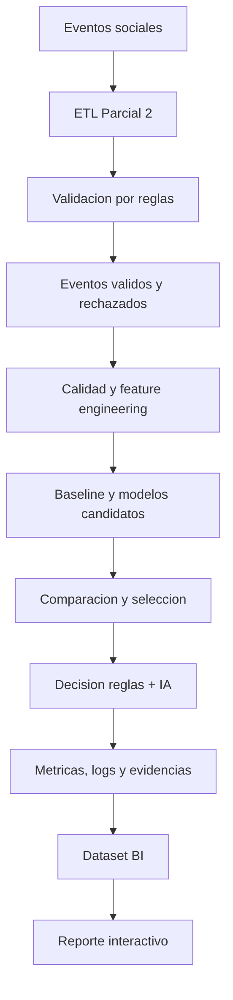

# NotifyOps Parcial 3 - Diseno de Cierre Final

## 1. Objetivo

Evolucionar la entrega existente de NotifyOps sin convertirla en un proyecto nuevo. El estado final debe demostrar, de manera reproducible y trazable, como el pipeline ETL de Parcial 2 fue mejorado en Parcial 3 mediante calidad de datos, entrenamiento y comparacion de modelos, seguridad, rendimiento, automatizacion y visualizacion BI.

El alcance se limita a cerrar brechas verificadas de la rubrica. No se agregaran servicios, frameworks o funcionalidades que no aporten evidencia evaluable.

## 2. Principios

- Una sola fuente de verdad para datos, metricas y resultados.
- Toda afirmacion del README debe apuntar a un artefacto real.
- Los comandos deben funcionar desde la raiz del repositorio.
- Los resultados deben ser deterministas y coincidir entre codigo, BI, informe y presentacion.
- El proyecto debe poder ejecutarse localmente sin configuraciones ocultas.
- Los datos personales no deben exponerse innecesariamente en visualizaciones.
- Las limitaciones deben declararse con honestidad y acompaniarse de mejoras viables.

## 3. Estado que se conserva de Parcial 2

- Pipeline ETL para eventos `like`, `comment` y `follow`.
- Ingesta desde CSV.
- Limpieza y transformacion.
- Validacion estructural y semantica.
- Separacion entre eventos validos y rechazados.
- Generacion de notificaciones, KPIs, SQLite y logs.
- Automatizacion quincenal mediante Airflow.
- Pruebas automatizadas del pipeline y del DAG.

## 4. Mejoras finales de Parcial 3

### 4.1 Calidad y preparacion de datos

El analisis debe incluir:

- cantidad y porcentaje de nulos;
- duplicados;
- fechas invalidas;
- tipos de evento no permitidos;
- distribucion de clases;
- media, moda y percentiles para variables numericas relevantes;
- estrategia explicita de tratamiento de valores faltantes;
- particion reproducible de entrenamiento y prueba;
- analisis univariado, bivariado y matriz de correlacion.

Los resultados se almacenaran en CSV y graficos reutilizables por README, BI, informe y presentacion.

### 4.2 Modelo de IA y comparacion

Se mantendra un modelo principal sencillo y defendible. Se agregara:

- baseline basado en reglas o clase mayoritaria;
- segundo algoritmo apropiado al volumen y tipo de datos;
- comparacion comun mediante accuracy, precision, recall, F1, ROC-AUC y Gini;
- matriz de confusion por modelo;
- justificacion de la seleccion final;
- medicion de tiempo de entrenamiento e inferencia;
- version y fecha de ejecucion.

La etiqueta no debe depender exclusivamente de las mismas reglas usadas como variables. El conjunto de datos debe permitir demostrar casos donde la capa predictiva aporte una decision adicional, sin permitir que la IA anule errores objetivos del pipeline.

### 4.3 Decision operacional

La decision final conservara tres estados:

- `rechazado_por_reglas`: incumple una condicion estructural obligatoria;
- `revision_por_ia`: pasa reglas, pero presenta riesgo predictivo alto;
- `aprobado_para_notificar`: pasa reglas y presenta riesgo bajo.

Debe existir al menos evidencia controlada y explicable de los tres estados. La generacion sera determinista.

### 4.4 Automatizacion

Airflow debe orquestar el flujo mejorado:

1. ejecutar ETL;
2. verificar salidas ETL;
3. entrenar y evaluar modelos;
4. verificar metricas y artefactos de Parcial 3.

La frecuencia quincenal se conserva porque representa el ciclo de experimentacion del caso. Docker continuara siendo un entorno academico local, sin afirmar que es una configuracion productiva.

### 4.5 Rendimiento y logs

Se generara evidencia local verificable de:

- duracion de ETL;
- duracion de entrenamiento;
- duracion de inferencia;
- cantidad de filas procesadas;
- rendimiento por segundo cuando sea aplicable;
- fecha, entorno y version de ejecucion;
- logs de las etapas principales.

La documentacion distinguira claramente entre mediciones reales y latencias simuladas. La ausencia de despliegue en nube se declarara como limitacion, sin presentar evidencia local como nube.

### 4.6 Seguridad

La auditoria vinculara cada activo con:

- clasificacion de sensibilidad;
- amenaza o riesgo;
- control aplicado o propuesto;
- rol autorizado;
- principio legal relacionado.

Las salidas publicas y BI usaran agregados o identificadores pseudonimizados. La documentacion diferenciara la Ley 19.628 vigente durante la evaluacion y la Ley 21.719, publicada el 13 de diciembre de 2024 y con entrada en vigencia el 1 de diciembre de 2026.

### 4.7 Integracion BI

La fuente oficial sera `data/bi/notifyops_powerbi_dataset.xlsx`, construida a partir de los resultados finales y validada contra los CSV del pipeline.

El reporte BI tendra tres vistas:

1. **Resumen ejecutivo:** metricas del modelo, decisiones y filtros.
2. **Modelo y calidad:** matrices de confusion, comparacion, variables y problemas de calidad.
3. **Seguridad y operacion:** rendimiento, activos sensibles, controles y roles.

La interactividad minima comprende filtros por tipo de evento, decision y fecha, ademas de interaccion entre visuales. El artefacto Power BI y sus capturas solo se declararan terminados cuando existan y hayan sido comprobados.

Si Power BI Desktop no esta disponible en el entorno de trabajo, se dejaran completamente preparados y verificados el dataset, el modelo de datos, la especificacion de visuales y las evidencias locales; la creacion del archivo propietario `.pbix` quedara marcada como paso externo pendiente, no como cumplimiento realizado.

### 4.8 README

El README vigente se evolucionara, no se reemplazara conceptualmente. Su estructura final sera:

1. resumen e identidad del proyecto;
2. indice navegable;
3. evolucion Parcial 2 versus Parcial 3;
4. arquitectura anterior y arquitectura mejorada;
5. componentes y flujo de decision;
6. resultados verificados;
7. ejecucion completa, con comando, resultado y evidencia;
8. Airflow y Docker;
9. Power BI;
10. seguridad y normativa;
11. matriz de evidencias de rubrica;
12. limitaciones y mejoras;
13. guion breve de demostracion.

Se eliminara cualquier declaracion de cumplimiento total que no tenga un artefacto verificable.

## 5. Flujo final

## 6. Evidencia requerida

| Requisito | Evidencia final |
|---|---|
| Calidad de datos | CSV, notebook ejecutado y graficos |
| Particion y preprocesamiento | codigo, resumen de particion y reporte |
| Analisis univariado y bivariado | graficos y correlacion |
| Comparacion de modelos | tabla comparativa y matrices |
| Metricas | CSV/JSON, graficos e interpretacion |
| Rendimiento | CSV, logs y grafico de tiempos |
| Seguridad | matriz de activos, controles y roles |
| BI | Excel validado, reporte interactivo y capturas |
| Automatizacion | DAG mejorado, pruebas y evidencia de ejecucion |
| Limitaciones y mejoras | README, informe y presentacion |

## 7. Validacion

El cierre requerira:

- pruebas unitarias completas;
- ejecucion limpia de ETL;
- ejecucion limpia del entrenamiento;
- validacion de consistencia entre CSV, JSON, Excel y dashboard;
- validacion del DAG y Docker Compose;
- notebook con salidas ejecutadas;
- inspeccion visual de graficos y dashboard;
- README probado siguiendo exactamente sus comandos;
- verificacion de estado Git y repositorio remoto antes de declarar la entrega terminada.

## 8. Fuera de alcance

- procesamiento realmente distribuido;
- streaming productivo;
- infraestructura cloud productiva;
- autenticacion empresarial;
- monitoreo permanente en produccion;
- incorporacion del proyecto externo de correos spam;
- inclusion de entornos virtuales o dependencias empaquetadas.

Estas capacidades pueden mencionarse como mejoras futuras, pero no se implementaran para aparentar un alcance superior al solicitado.
